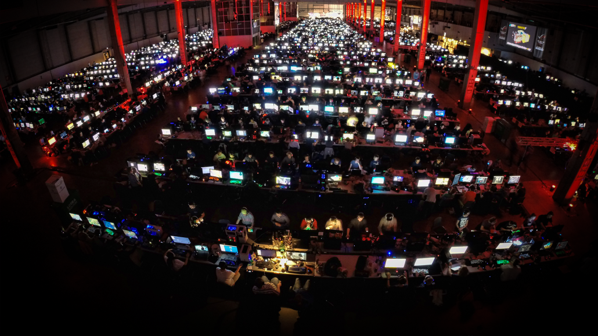

I was one of the last kids in school to get internet. Instead, I got used to rushing down to the school library during lunch break to capture one of their 3 computers, open up Internet Explorer and log into Runescape. Or Adventure Quest. Those were the days.

Later, when we got our own internet connection at home, I ended up playing a lot of World of Warcraft and Battlefield 2. I've spent thousands of hours on the internet, chatting on MSN Messenger, looking at the Danish version of MySpace, Arto, and trash talking my friends on TeamSpeak.

But I never asked the question: "What is the internet, anyway?". Like the vast majority of people, I took it for granted.

## A beer with a friend
Recently I was out in Copenhagen, having some beers with my friend. We talked about a lot  of things, including Half-Life, open-source software, digital sovereignty and so on. Biking home afterwards, the nostalgia of the Half-Life era made my mind wander back to the LAN parties of old: passing a Warcraft III: The Frozen Throne CD around, spending hours upon hours playing Footman Frenzy and sleeping 3 hours beneath your desk and eating nothing but pizza for the whole weekend.

> "My life for Ner'Zhul!"
>
> <cite>- A servant to the dark lord</cite>

## Sudden thought and what's next
Then it hit me: the internet is just a really large LAN party with a lot of extra steps! But it still boils down to some people connecting their computers together. Just how it started back with ARPANET in 1969. I can get in a car and drive on a continuous road from Denmark to Beijing, and I can track a cable from Denmark to Buenos Aires. Is this a banal thought? Yes. Does it excite me? Yes.

A huge LAN (NPF) in Denmark I've volunteered at. Photo by NPF.

Anyway. This threw me into a new project, where I have decided to **actually** understand what the internet is.

I guess we'll start somewhere - with the humble *socket*.
